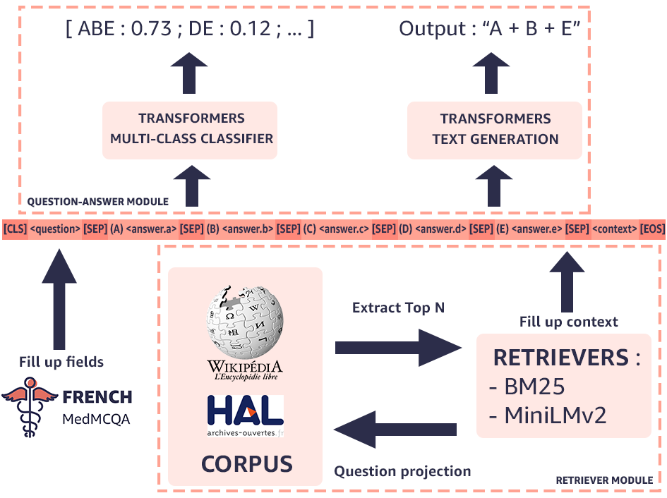

<h1 align="center">FrenchMedMCQA </h1>

<p align="center">
  
</p>

<h3 align="center">FrenchMedMCQA: A French Multiple-Choice Question Answering Dataset for Medical domain</h3>

FrenchMedMCQA is the first publicly available Multiple-Choice Question Answering (MCQA) dataset in French for medical domain. It is composed of 3,105 questions taken from real exams of the French medical specialization diploma in pharmacy, mixing  single  and multiple answers.

[](https://opensource.org/licenses/Apache-2.0)

## Dataset Description

|                        | Links                                               | 
| :--------------------: |:---------------------------------------------------:|
| **Homepage:**          |  https://github.com/qanastek/FrenchMedMCQA          | 
| **Repository:**        |  https://github.com/qanastek/FrenchMedMCQA          | 
| **Paper:**             |  https://hal.archives-ouvertes.fr/hal-03824241v1    | 
| **Leaderboard:**       |  https://paperswithcode.com/dataset/frenchmedmcqa   |
| **Point of Contact:**  |  [Yanis LABRAK](mailto:yanis.labrak@univ-avignon.fr) |

## Dataset Summary

FrenchMedMCQA is the first open-source Multiple-Choice Question Answering (MCQA) dataset which propose questions with a single or multiple answer(s) based on real-world medical exam questions.

## Data Download and Preprocessing

To collect the dataset mentioned in the paper, please follow the below steps :

- Clone the repo
- Go into `./spiders/` by using `cd ./spiders/`
- Install the dependencies : `pip3 install -r requirements.txt`
- Run the download, processing and verification scripts using : `bash ./run_scrapping.sh`
- The corpus is transformed into :
    - JSON files available in `./corpus/`
    - CSV files available in `./corpus_csv/`

## Supported Tasks and Leaderboards

`multiple-choice-QA` , `open-domain-QA`: The dataset can be used to train a model for multi-choice questions answering, open domain questions answering.

The questions on these exams are difficult and often necessitate a deeper domain and language comprehension.

## Languages

The questions and answers are available in French.

## Dataset Structure

### Data Instances

Example of a question with multiple answers :

```json
{
    "id": "6979d46501a3270436d37b98cf351439fbcbec8d5890d293dabfb8f85f723904",
    "question": "Cocher la (les) proposition(s) exacte(s) : Le métronidazole :",
    "answers": {
        "a": "Est un dérivé du pyrazole",
        "b": "Peut induire un effet antabuse",
        "c": "Peut être administré par voie parentérale intraveineuse",
        "d": "Peut être utilisé dans certaines parasitoses à protozoaires",
        "e": "Est inefficace dans les infections à germes anaérobies"
    },
    "correct_answers": [
        "b",
        "c",
        "d"
    ],
}
```

### Data Fields

- `id` : Question identifier
- `question` : Question text
- `answers` : The list of 5 options from A to E
- `correct_answers` : Correct option(s) (Can be one or more answer(s) to the question)

### Data Splits

Globally, 70 % of the questions are kept for the train, 10 % for validation and last 20 % for testing.

The distribution of the subsets according to the number of answers are as follow :

| # Answers | Training   | Validation | Test    | Total     |
| --------- | ---------- | ---------- | ------- | --------- |
| 1         | 595        | 164        | 321     | **1,080** |
| 2         | 528        | 45         | 97      | **670**   |
| 3         | 718        | 71         | 141     | **930**   |
| 4         | 296        | 30         | 56      | **382**   |
| 5         | 34         | 2          | 7       | **43**    |
| Total     | **2171**   | **312**    | **622** | **3,105** |

### Citation Information

We would very much appreciate it if you cite our publications :

```bibtex
@unpublished{labrak:hal-03824241,
  TITLE = {{FrenchMedMCQA: A French Multiple-Choice Question Answering Dataset for Medical domain}},
  AUTHOR = {Labrak, Yanis and Bazoge, Adrien and Dufour, Richard and Daille, B{\'e}atrice and Gourraud, Pierre-Antoine and Morin, Emmanuel and Rouvier, Mickael},
  URL = {https://hal.archives-ouvertes.fr/hal-03824241},
  NOTE = {working paper or preprint},
  YEAR = {2022},
  MONTH = Oct,
  PDF = {https://hal.archives-ouvertes.fr/hal-03824241/file/LOUHI_2022___QA-3.pdf},
  HAL_ID = {hal-03824241},
  HAL_VERSION = {v1},
}
```
